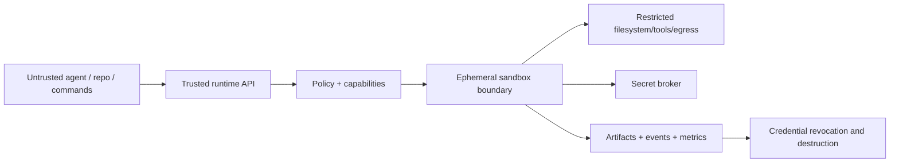

# Secure Agent Runtime

A governed execution platform for autonomous agents running **untrusted generated code**. Agents submit a bounded task; the control plane authenticates the tenant, evaluates policy/capabilities, creates one ephemeral sandbox, brokers only task-scoped credentials, captures approved artifacts/audit events, revokes grants, and destroys the sandbox.



## Local mode and honesty

The tested local control-plane lifecycle uses a fake backend in unit/security tests. The operational local backend is a hardened Docker container with non-root execution, read-only filesystem, dropped capabilities, no-new-privileges, default seccomp, PID/CPU/memory/time limits, and `--network none`. It does **not** provide VM-equivalent isolation. No Docker socket, host path, host network, Kubernetes credentials, cloud credentials, or user credential directory is mounted.

```console
make install && make test
make demo
make demo-security
make run
```

See [threat model](docs/threat-model.md), [security invariants](docs/security-invariants.md), [sandbox lifecycle](docs/sandbox-lifecycle.md), and [local development](docs/local-development.md). gVisor and Firecracker are architecture/optional deployment paths, not locally claimed validation.

Next: run the demos, inspect the policy tests, or follow the gVisor validation guide on a supported Linux/Kubernetes host.
